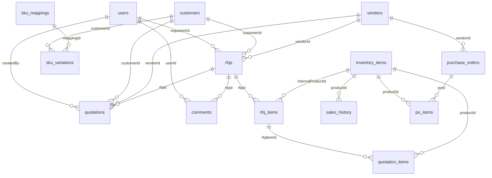

# Database Schema Documentation

## Overview
This document describes the database schema for the UDS RFQ Automation system, including all tables, fields, relationships, and a Mermaid ER diagram.

---

## Entity Summary
| Table Name         | Description                                 |
|-------------------|---------------------------------------------|
| users             | System users (admins, sales, etc.)           |
| customers         | Customer companies/contacts                  |
| vendors           | Vendor companies/contacts                    |
| rfqs              | Request for Quotation records                |
| rfq_items         | Line items for each RFQ                      |
| quotations        | Quotes submitted for RFQs                    |
| quotation_items   | Line items for each quote                    |
| inventory_items   | Inventory products/items                     |
| sales_history     | Historical sales records                     |
| purchase_orders   | Purchase orders to vendors                   |
| po_items          | Line items for each purchase order           |
| sku_mappings      | Standardized SKU definitions                 |
| sku_variations    | Customer-specific SKU variations             |
| audit_log         | System audit logs                            |
| comments          | Comments on RFQs                             |

---

## Enums
| Enum Name        | Values                                      |
|------------------|---------------------------------------------|
| rfq_status       | PENDING, IN_REVIEW, APPROVED, REJECTED, COMPLETED |
| user_role        | ADMIN, MANAGER, EMPLOYEE, SALES             |
| customer_type    | WHOLESALER, DEALER, RETAILER, DIRECT        |

---

## Table Details

### users
| Column      | Type      | Notes                |
|-------------|-----------|----------------------|
| id          | serial PK | User ID              |
| email       | varchar   | Unique, not null     |
| name        | varchar   | Not null             |
| password    | varchar   | Not null             |
| role        | enum      | user_role, default EMPLOYEE |
| department  | varchar   |                      |
| createdAt   | timestamp | Default now          |
| updatedAt   | timestamp | Default now          |

### customers
| Column         | Type      | Notes                |
|----------------|-----------|----------------------|
| id             | serial PK | Customer ID          |
| name           | varchar   | Not null             |
| type           | enum      | customer_type        |
| region         | varchar   |                      |
| email          | varchar   |                      |
| phone          | varchar   |                      |
| address        | text      |                      |
| contactPerson  | varchar   |                      |
| quickbooksId   | varchar   |                      |
| isActive       | boolean   | Default true         |
| createdAt      | timestamp | Default now          |
| updatedAt      | timestamp | Default now          |

### vendors
| Column         | Type      | Notes                |
|----------------|-----------|----------------------|
| id             | serial PK | Vendor ID            |
| name           | varchar   | Not null             |
| email          | varchar   |                      |
| phone          | varchar   |                      |
| address        | text      |                      |
| contactPerson  | varchar   |                      |
| category       | varchar   |                      |
| isActive       | boolean   | Default true         |
| quickbooksId   | varchar   |                      |
| createdAt      | timestamp | Default now          |
| updatedAt      | timestamp | Default now          |

### rfqs
| Column         | Type      | Notes                |
|----------------|-----------|----------------------|
| id             | serial PK | RFQ ID               |
| rfqNumber      | varchar   | Unique, not null     |
| title          | varchar   | Not null             |
| description    | text      | Not null             |
| requestorId    | int FK    | users.id             |
| customerId     | int FK    | customers.id         |
| vendorId       | int FK    | vendors.id           |
| status         | enum      | rfq_status           |
| dueDate        | date      |                      |
| attachments    | jsonb     |                      |
| totalBudget    | real      |                      |
| approvedBy     | int FK    | users.id             |
| rejectionReason| text      |                      |
| source         | varchar   | Not null             |
| notes          | text      |                      |
| createdAt      | timestamp | Default now          |
| updatedAt      | timestamp | Default now          |

### rfq_items
| Column            | Type      | Notes                |
|-------------------|-----------|----------------------|
| id                | serial PK | RFQ Item ID          |
| rfqId             | int FK    | rfqs.id              |
| name              | varchar   | Not null             |
| description       | text      |                      |
| quantity          | int       | Not null             |
| unit              | varchar   |                      |
| customerSku       | varchar   |                      |
| internalProductId | int FK    | inventory_items.id   |
| suggestedPrice    | real      |                      |
| finalPrice        | real      |                      |
| currency          | varchar   | Default CAD          |
| status            | varchar   | Default PENDING      |
| estimatedPrice    | real      |                      |
| createdAt         | timestamp | Default now          |
| updatedAt         | timestamp | Default now          |

### quotations
| Column             | Type      | Notes                |
|--------------------|-----------|----------------------|
| id                 | serial PK | Quotation ID         |
| quoteNumber        | varchar   | Unique, not null     |
| rfqId              | int FK    | rfqs.id              |
| customerId         | int FK    | customers.id         |
| vendorId           | int FK    | vendors.id           |
| totalAmount        | real      | Not null             |
| deliveryTime       | varchar   |                      |
| validUntil         | date      |                      |
| termsAndConditions | text      |                      |
| attachments        | jsonb     |                      |
| isSelected         | boolean   | Default false        |
| status             | varchar   | Default PENDING      |
| notes              | text      |                      |
| expiryDate         | date      |                      |
| createdBy          | int FK    | users.id             |
| createdAt          | timestamp | Default now          |
| updatedAt          | timestamp | Default now          |

### quotation_items
| Column         | Type      | Notes                |
|----------------|-----------|----------------------|
| id             | serial PK | Quotation Item ID    |
| quotationId    | int FK    | quotations.id        |
| rfqItemId      | int FK    | rfq_items.id         |
| productId      | int FK    | inventory_items.id   |
| unitPrice      | real      | Not null             |
| quantity       | int       | Not null             |
| extendedPrice  | real      | Not null             |
| currency       | varchar   | Default CAD          |
| description    | text      |                      |
| createdAt      | timestamp | Default now          |
| updatedAt      | timestamp | Default now          |

### inventory_items
| Column           | Type      | Notes                |
|------------------|-----------|----------------------|
| id               | serial PK | Inventory Item ID    |
| sku              | varchar   | Unique, not null     |
| mpn              | varchar   | Not null             |
| brand            | varchar   | Not null             |
| category         | varchar   | Default OTHER        |
| description      | text      | Not null             |
| stock            | int       | Default 0            |
| costCad          | real      |                      |
| costUsd          | real      |                      |
| warehouseLocation| varchar   |                      |
| quantityOnHand   | int       | Default 0            |
| quantityReserved | int       | Default 0            |
| lowStockThreshold| int       | Default 5            |
| lastSaleDate     | date      |                      |
| quickbooksItemId | varchar   |                      |
| createdAt        | timestamp | Default now          |
| updatedAt        | timestamp | Default now          |

### sales_history
| Column            | Type      | Notes                |
|-------------------|-----------|----------------------|
| id                | serial PK | Sales History ID     |
| invoiceNumber     | varchar   | Not null             |
| customerId        | int FK    | customers.id         |
| productId         | int FK    | inventory_items.id   |
| quantity          | int       | Not null             |
| unitPrice         | real      | Not null             |
| extendedPrice     | real      | Not null             |
| currency          | varchar   | Default CAD          |
| saleDate          | date      | Not null             |
| quickbooksInvoiceId| varchar  |                      |
| createdAt         | timestamp | Default now          |
| updatedAt         | timestamp | Default now          |

### purchase_orders
| Column           | Type      | Notes                |
|------------------|-----------|----------------------|
| id               | serial PK | Purchase Order ID    |
| poNumber         | varchar   | Unique, not null     |
| vendorId         | int FK    | vendors.id           |
| status           | varchar   | Not null             |
| orderDate        | timestamp | Not null             |
| expectedArrivalDate| date    |                      |
| totalAmount      | real      | Not null             |
| currency         | varchar   | Default CAD          |
| quickbooksPoId   | varchar   |                      |
| createdAt        | timestamp | Default now          |
| updatedAt        | timestamp | Default now          |

### po_items
| Column         | Type      | Notes                |
|----------------|-----------|----------------------|
| id             | serial PK | PO Item ID           |
| poId           | int FK    | purchase_orders.id   |
| productId      | int FK    | inventory_items.id   |
| quantity       | int       | Not null             |
| unitCost       | real      | Not null             |
| extendedCost   | real      | Not null             |
| currency       | varchar   | Default CAD          |
| createdAt      | timestamp | Default now          |
| updatedAt      | timestamp | Default now          |

### sku_mappings
| Column           | Type      | Notes                |
|------------------|-----------|----------------------|
| id               | serial PK | SKU Mapping ID       |
| standardSku      | varchar   | Unique, not null     |
| standardDescription| text    | Not null             |
| createdAt        | timestamp | Default now          |
| updatedAt        | timestamp | Default now          |

### sku_variations
| Column         | Type      | Notes                |
|----------------|-----------|----------------------|
| id             | serial PK | SKU Variation ID     |
| mappingId      | int FK    | sku_mappings.id      |
| customerId     | int FK    | customers.id         |
| variationSku   | varchar   | Not null             |
| source         | varchar   | Not null             |
| createdAt      | timestamp | Default now          |
| updatedAt      | timestamp | Default now          |

### audit_log
| Column      | Type      | Notes                |
|-------------|-----------|----------------------|
| id          | serial PK | Audit Log ID         |
| timestamp   | timestamp | Default now          |
| userId      | int FK    | users.id             |
| action      | varchar   | Not null             |
| entityType  | varchar   |                      |
| entityId    | int       |                      |
| details     | jsonb     |                      |

### comments
| Column      | Type      | Notes                |
|-------------|-----------|----------------------|
| id          | serial PK | Comment ID           |
| content     | text      | Not null             |
| userId      | int FK    | users.id             |
| rfqId       | int FK    | rfqs.id              |
| createdAt   | timestamp | Default now          |
| updatedAt   | timestamp | Default now          |

---

## Relationships
- **users** 1---* **rfqs** (requestorId)
- **users** 1---* **quotations** (createdBy)
- **users** 1---* **comments** (userId)
- **customers** 1---* **rfqs** (customerId)
- **customers** 1---* **quotations** (customerId)
- **customers** 1---* **sku_variations** (customerId)
- **vendors** 1---* **rfqs** (vendorId)
- **vendors** 1---* **quotations** (vendorId)
- **vendors** 1---* **purchase_orders** (vendorId)
- **rfqs** 1---* **rfq_items** (rfqId)
- **rfqs** 1---* **quotations** (rfqId)
- **rfqs** 1---* **comments** (rfqId)
- **rfq_items** 1---* **quotation_items** (rfqItemId)
- **inventory_items** 1---* **rfq_items** (internalProductId)
- **inventory_items** 1---* **quotation_items** (productId)
- **inventory_items** 1---* **sales_history** (productId)
- **inventory_items** 1---* **po_items** (productId)
- **purchase_orders** 1---* **po_items** (poId)
- **sku_mappings** 1---* **sku_variations** (mappingId)

---

## ER Diagram (Mermaid)

---

## Notes
- Additional tables (settings, email templates, audit log, etc.) exist for configuration, logging, and automation support.
- All timestamps are in UTC.
- Foreign keys are indicated by (FK: ...). 