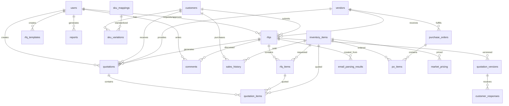

# Database Schema Documentation

## Overview
This document describes the complete database schema for the UDS RFQ Automation system, including all tables, fields, relationships, and entity-relationship diagrams. The system supports comprehensive RFQ management, inventory tracking, sales history, email automation, and reporting functionality.

---

## Entity Summary
| Table Name              | Description                                    |
|------------------------|------------------------------------------------|
| users                  | System users (admins, sales, employees)       |
| customers              | Customer companies/contacts                    |
| vendors                | Vendor companies/contacts                      |
| rfqs                   | Request for Quotation records                  |
| rfq_items              | Line items for each RFQ                       |
| quotations             | Quotes submitted for RFQs                     |
| quotation_items        | Line items for each quote                     |
| quotation_versions     | Version control for quotations                |
| customer_responses     | Customer responses to quotation versions      |
| inventory_items        | Inventory products/items                       |
| sales_history          | Historical sales records                       |
| purchase_orders        | Purchase orders to vendors                     |
| po_items               | Line items for each purchase order            |
| market_pricing         | Market pricing data for products              |
| sku_mappings           | Standardized SKU definitions                   |
| sku_variations         | Customer-specific SKU variations               |
| audit_log              | System audit logs                              |
| comments               | Comments on RFQs                               |
| email_templates        | Email template definitions                     |
| email_settings         | Email automation configuration                |
| email_accounts         | Email account configurations                   |
| email_rules            | Email parsing and processing rules            |
| email_parsing_results  | Results from email parsing operations        |
| rfq_templates          | RFQ template definitions                       |
| reports                | Generated reports and analytics               |
| settings               | System configuration settings                  |

---

## Enums
| Enum Name        | Values                                      |
|------------------|---------------------------------------------|
| rfq_status       | PENDING, IN_REVIEW, APPROVED, REJECTED, COMPLETED |
| user_role        | ADMIN, MANAGER, EMPLOYEE, SALES             |
| customer_type    | WHOLESALER, DEALER, RETAILER, DIRECT        |

---

## Core Tables

### users
| Column      | Type      | Notes                |
|-------------|-----------|----------------------|
| id          | serial PK | User ID              |
| email       | varchar   | Unique, not null     |
| name        | varchar   | Not null             |
| password    | varchar   | Not null             |
| role        | enum      | user_role, default EMPLOYEE |
| department  | varchar   |                      |
| createdAt   | timestamp | Default now          |
| updatedAt   | timestamp | Default now          |

### customers
| Column         | Type      | Notes                |
|----------------|-----------|----------------------|
| id             | serial PK | Customer ID          |
| name           | varchar   | Not null             |
| type           | enum      | customer_type        |
| region         | varchar   |                      |
| email          | varchar   |                      |
| phone          | varchar   |                      |
| address        | text      |                      |
| contactPerson  | varchar   |                      |
| quickbooksId   | varchar   | QuickBooks integration |
| isActive       | boolean   | Default true         |
| main_customer  | boolean   | Default false        |
| createdAt      | timestamp | Default now          |
| updatedAt      | timestamp | Default now          |

### vendors
| Column         | Type      | Notes                |
|----------------|-----------|----------------------|
| id             | serial PK | Vendor ID            |
| name           | varchar   | Not null             |
| email          | varchar   |                      |
| phone          | varchar   |                      |
| address        | text      |                      |
| contactPerson  | varchar   |                      |
| category       | varchar   |                      |
| isActive       | boolean   | Default true         |
| quickbooksId   | varchar   | QuickBooks integration |
| createdAt      | timestamp | Default now          |
| updatedAt      | timestamp | Default now          |

### rfqs
| Column         | Type      | Notes                |
|----------------|-----------|----------------------|
| id             | serial PK | RFQ ID               |
| rfqNumber      | varchar   | Unique, not null     |
| title          | varchar   | Not null             |
| description    | text      | Not null             |
| requestorId    | int FK    | users.id             |
| customerId     | int FK    | customers.id         |
| vendorId       | int FK    | vendors.id           |
| status         | enum      | rfq_status           |
| dueDate        | date      |                      |
| attachments    | jsonb     | Array of file paths  |
| totalBudget    | real      |                      |
| approvedBy     | int FK    | users.id             |
| rejectionReason| text      |                      |
| source         | varchar   | Not null (email/manual) |
| notes          | text      |                      |
| createdAt      | timestamp | Default now          |
| updatedAt      | timestamp | Default now          |

### rfq_items
| Column            | Type      | Notes                |
|-------------------|-----------|----------------------|
| id                | serial PK | RFQ Item ID          |
| rfqId             | int FK    | rfqs.id              |
| name              | varchar   | Not null             |
| description       | text      |                      |
| quantity          | int       | Not null             |
| unit              | varchar   |                      |
| customerSku       | varchar   |                      |
| internalProductId | int FK    | inventory_items.id   |
| suggestedPrice    | real      |                      |
| finalPrice        | real      |                      |
| currency          | varchar   | Default CAD          |
| status            | varchar   | Default PENDING      |
| estimatedPrice    | real      |                      |
| createdAt         | timestamp | Default now          |
| updatedAt         | timestamp | Default now          |

## Quotation & Version Control

### quotations
| Column             | Type      | Notes                |
|--------------------|-----------|----------------------|
| id                 | serial PK | Quotation ID         |
| quoteNumber        | varchar   | Unique, not null     |
| rfqId              | int FK    | rfqs.id              |
| customerId         | int FK    | customers.id         |
| vendorId           | int FK    | vendors.id           |
| totalAmount        | real      | Not null             |
| deliveryTime       | varchar   |                      |
| validUntil         | date      |                      |
| termsAndConditions | text      |                      |
| attachments        | jsonb     | Array of file paths  |
| isSelected         | boolean   | Default false        |
| status             | varchar   | Default PENDING      |
| notes              | text      |                      |
| expiryDate         | date      |                      |
| createdBy          | int FK    | users.id             |
| createdAt          | timestamp | Default now          |
| updatedAt          | timestamp | Default now          |

### quotation_versions
| Column         | Type      | Notes                |
|----------------|-----------|----------------------|
| id             | serial PK | Version ID           |
| rfqId          | int FK    | rfqs.id              |
| versionNumber  | int       | Not null             |
| status         | varchar   | Default NEW          |
| estimatedPrice | int       | Not null             |
| finalPrice     | int       | Not null             |
| changes        | text      | Change description   |
| createdBy      | varchar   | Not null             |
| createdAt      | timestamp | Default now          |
| updatedAt      | timestamp | Default now          |

### customer_responses
| Column           | Type      | Notes                |
|------------------|-----------|----------------------|
| id               | serial PK | Response ID          |
| versionId        | int FK    | quotation_versions.id |
| status           | varchar   | Not null             |
| comments         | text      |                      |
| requestedChanges | text      |                      |
| respondedAt      | timestamp | Default now          |

### quotation_items
| Column         | Type      | Notes                |
|----------------|-----------|----------------------|
| id             | serial PK | Quotation Item ID    |
| quotationId    | int FK    | quotations.id        |
| rfqItemId      | int FK    | rfq_items.id         |
| productId      | int FK    | inventory_items.id   |
| unitPrice      | real      | Not null             |
| quantity       | int       | Not null             |
| extendedPrice  | real      | Not null             |
| currency       | varchar   | Default CAD          |
| description    | text      |                      |
| createdAt      | timestamp | Default now          |
| updatedAt      | timestamp | Default now          |

## Inventory & Sales

### inventory_items
| Column           | Type      | Notes                |
|------------------|-----------|----------------------|
| id               | serial PK | Inventory Item ID    |
| sku              | varchar   | Unique, not null     |
| mpn              | varchar   | Manufacturer Part Number |
| brand            | varchar   | Not null             |
| category         | varchar   | Default OTHER        |
| description      | text      | Not null             |
| stock            | int       | Default 0            |
| costCad          | real      | Cost in CAD          |
| costUsd          | real      | Cost in USD          |
| warehouseLocation| varchar   |                      |
| quantityOnHand   | int       | Default 0            |
| quantityReserved | int       | Default 0            |
| lowStockThreshold| int       | Default 5            |
| lastSaleDate     | date      |                      |
| quickbooksItemId | varchar   | QuickBooks integration |
| createdAt        | timestamp | Default now          |
| updatedAt        | timestamp | Default now          |

### sales_history
| Column            | Type      | Notes                |
|-------------------|-----------|----------------------|
| id                | serial PK | Sales History ID     |
| invoiceNumber     | varchar   | Not null             |
| customerId        | int FK    | customers.id         |
| productId         | int FK    | inventory_items.id   |
| quantity          | int       | Not null             |
| unitPrice         | real      | Not null             |
| extendedPrice     | real      | Not null             |
| currency          | varchar   | Default CAD          |
| saleDate          | date      | Not null             |
| quickbooksInvoiceId| varchar  | QuickBooks integration |
| createdAt         | timestamp | Default now          |
| updatedAt         | timestamp | Default now          |

### purchase_orders
| Column           | Type      | Notes                |
|------------------|-----------|----------------------|
| id               | serial PK | Purchase Order ID    |
| poNumber         | varchar   | Unique, not null     |
| vendorId         | int FK    | vendors.id           |
| status           | varchar   | Not null             |
| orderDate        | timestamp | Not null             |
| expectedArrivalDate| date    |                      |
| totalAmount      | real      | Not null             |
| currency         | varchar   | Default CAD          |
| quickbooksPoId   | varchar   | QuickBooks integration |
| createdAt        | timestamp | Default now          |
| updatedAt        | timestamp | Default now          |

### po_items
| Column         | Type      | Notes                |
|----------------|-----------|----------------------|
| id             | serial PK | PO Item ID           |
| poId           | int FK    | purchase_orders.id   |
| productId      | int FK    | inventory_items.id   |
| quantity       | int       | Not null             |
| unitCost       | real      | Not null             |
| extendedCost   | real      | Not null             |
| currency       | varchar   | Default CAD          |
| createdAt      | timestamp | Default now          |
| updatedAt      | timestamp | Default now          |

### market_pricing
| Column       | Type      | Notes                |
|--------------|-----------|----------------------|
| id           | serial PK | Market Pricing ID    |
| productId    | int FK    | inventory_items.id   |
| source       | varchar   | Pricing source       |
| price        | real      | Not null             |
| currency     | varchar   | Default CAD          |
| lastUpdated  | timestamp | Default now          |

## SKU Management

### sku_mappings
| Column           | Type      | Notes                |
|------------------|-----------|----------------------|
| id               | serial PK | SKU Mapping ID       |
| standardSku      | varchar   | Unique, not null     |
| standardDescription| text    | Not null             |
| createdAt        | timestamp | Default now          |
| updatedAt        | timestamp | Default now          |

### sku_variations
| Column         | Type      | Notes                |
|----------------|-----------|----------------------|
| id             | serial PK | SKU Variation ID     |
| mappingId      | int FK    | sku_mappings.id (cascade) |
| customerId     | int FK    | customers.id (cascade) |
| variationSku   | varchar   | Not null             |
| source         | varchar   | Not null             |
| createdAt      | timestamp | Default now          |
| updatedAt      | timestamp | Default now          |

## Email Automation

### email_settings
| Column                      | Type      | Notes                |
|-----------------------------|-----------|----------------------|
| id                          | serial PK | Email Settings ID    |
| enabled                     | boolean   | Default true         |
| checkInterval               | int       | Default 5 minutes    |
| skuDetectionEnabled         | boolean   | Default true         |
| skuAutoMap                  | boolean   | Default true         |
| skuConfidenceThreshold      | int       | Default 85           |
| customerDetectionEnabled    | boolean   | Default true         |
| customerAutoAssign          | boolean   | Default true         |
| customerConfidenceThreshold | int       | Default 80           |
| updatedAt                   | timestamp | Default now          |

### email_accounts
| Column     | Type      | Notes                |
|------------|-----------|----------------------|
| id         | serial PK | Email Account ID     |
| email      | varchar   | Unique, not null     |
| protocol   | varchar   | Not null (IMAP/POP3) |
| server     | varchar   | Not null             |
| port       | int       | Not null             |
| ssl        | boolean   | Default true         |
| username   | varchar   | Not null             |
| password   | varchar   | Not null             |
| folders    | jsonb     | Default ['INBOX']    |
| isActive   | boolean   | Default true         |
| createdAt  | timestamp | Default now          |
| updatedAt  | timestamp | Default now          |

### email_rules
| Column     | Type      | Notes                |
|------------|-----------|----------------------|
| id         | serial PK | Email Rule ID        |
| name       | varchar   | Not null             |
| condition  | varchar   | Not null             |
| action     | varchar   | Default parse        |
| prioritize | boolean   | Default false        |
| isActive   | boolean   | Default true         |
| createdAt  | timestamp | Default now          |
| updatedAt  | timestamp | Default now          |

### email_parsing_results
| Column       | Type      | Notes                |
|--------------|-----------|----------------------|
| id           | serial PK | Parsing Result ID    |
| messageId    | varchar   |                      |
| subject      | varchar   |                      |
| sender       | varchar   |                      |
| receivedAt   | timestamp |                      |
| parsedAt     | timestamp | Default now          |
| customerInfo | jsonb     |                      |
| items        | jsonb     | Array of items       |
| confidence   | int       |                      |
| status       | varchar   | Default PROCESSED    |
| rfqId        | int FK    | rfqs.id              |
| notes        | text      |                      |

## Templates & Configuration

### email_templates
| Column     | Type      | Notes                |
|------------|-----------|----------------------|
| id         | serial PK | Email Template ID    |
| name       | varchar   | Not null             |
| subject    | varchar   | Not null             |
| body       | text      | Not null             |
| variables  | jsonb     | Array of variables   |
| isActive   | boolean   | Default true         |
| createdAt  | timestamp | Default now          |
| updatedAt  | timestamp | Default now          |

### rfq_templates
| Column      | Type      | Notes                |
|-------------|-----------|----------------------|
| id          | serial PK | RFQ Template ID      |
| name        | varchar   | Not null             |
| description | text      |                      |
| columns     | jsonb     | Array of columns     |
| isActive    | boolean   | Default true         |
| createdBy   | int FK    | users.id             |
| metadata    | jsonb     |                      |
| createdAt   | timestamp | Default now          |
| updatedAt   | timestamp | Default now          |

### settings
| Column      | Type      | Notes                |
|-------------|-----------|----------------------|
| id          | serial PK | Setting ID           |
| key         | varchar   | Unique, not null     |
| value       | text      | Not null             |
| description | text      |                      |
| updatedBy   | int FK    | users.id             |
| createdAt   | timestamp | Default now          |
| updatedAt   | timestamp | Default now          |

## Reporting & Audit

### reports
| Column      | Type      | Notes                |
|-------------|-----------|----------------------|
| id          | serial PK | Report ID            |
| name        | varchar   | Not null             |
| description | text      |                      |
| type        | varchar   | Not null             |
| createdAt   | timestamp | Default now          |
| updatedAt   | timestamp | Default now          |
| createdBy   | int FK    | users.id             |
| filters     | jsonb     | Report filters       |
| data        | jsonb     | Report data          |

### audit_log
| Column      | Type      | Notes                |
|-------------|-----------|----------------------|
| id          | serial PK | Audit Log ID         |
| timestamp   | timestamp | Default now          |
| userId      | int FK    | users.id             |
| action      | varchar   | Not null             |
| entityType  | varchar   |                      |
| entityId    | int       |                      |
| details     | jsonb     |                      |

### comments
| Column      | Type      | Notes                |
|-------------|-----------|----------------------|
| id          | serial PK | Comment ID           |
| content     | text      | Not null             |
| userId      | int FK    | users.id             |
| rfqId       | int FK    | rfqs.id              |
| createdAt   | timestamp | Default now          |
| updatedAt   | timestamp | Default now          |

---

## Key Relationships

### Core RFQ Flow
- **users** 1---* **rfqs** (requestorId, approvedBy)
- **customers** 1---* **rfqs** (customerId)
- **vendors** 1---* **rfqs** (vendorId)
- **rfqs** 1---* **rfq_items** (rfqId)
- **rfqs** 1---* **quotations** (rfqId)
- **rfqs** 1---* **quotation_versions** (rfqId)
- **rfqs** 1---* **comments** (rfqId)

### Quotation Management
- **quotations** 1---* **quotation_items** (quotationId)
- **quotation_versions** 1---* **customer_responses** (versionId)
- **rfq_items** 1---* **quotation_items** (rfqItemId)

### Inventory & Sales
- **inventory_items** 1---* **rfq_items** (internalProductId)
- **inventory_items** 1---* **quotation_items** (productId)
- **inventory_items** 1---* **sales_history** (productId)
- **inventory_items** 1---* **po_items** (productId)
- **inventory_items** 1---* **market_pricing** (productId)

### SKU Management
- **sku_mappings** 1---* **sku_variations** (mappingId)
- **customers** 1---* **sku_variations** (customerId)

### Email Automation
- **email_parsing_results** *---1 **rfqs** (rfqId)

### Templates & Configuration
- **users** 1---* **rfq_templates** (createdBy)
- **users** 1---* **reports** (createdBy)
- **users** 1---* **settings** (updatedBy)

---

## ER Diagram (Mermaid)

---

## Currency Support
The system supports multi-currency operations with the following features:
- **Default Currency**: CAD (Canadian Dollar)
- **Secondary Currency**: USD (US Dollar)
- **Currency Fields**: All monetary fields include currency specification
- **Exchange Rate Management**: Manual and automatic exchange rate handling
- **Consistent Display**: Always shows "1 USD = X CAD" format

## QuickBooks Integration
Tables with QuickBooks integration capabilities:
- **customers** (quickbooksId)
- **vendors** (quickbooksId)
- **inventory_items** (quickbooksItemId)
- **sales_history** (quickbooksInvoiceId)
- **purchase_orders** (quickbooksPoId)

## Email Automation Features
- **Automated Email Processing**: Configurable email account monitoring
- **SKU Detection**: Automatic SKU recognition and mapping
- **Customer Detection**: Automatic customer identification
- **Rule-Based Processing**: Customizable email processing rules
- **Confidence Scoring**: AI-powered confidence levels for automation decisions

## Notes
- All timestamps are in UTC
- JSONB fields are used for flexible data storage (attachments, metadata, configurations)
- Cascade deletes are implemented for SKU variations
- Foreign key constraints ensure data integrity
- Default values are set for operational efficiency
- The schema supports both manual and automated RFQ creation workflows
