# Database Schema Documentation

## Overview
This document describes the complete database schema for the UDS RFQ Automation system, including all tables, fields, relationships, and entity-relationship diagrams. The system supports comprehensive RFQ management, inventory tracking, sales history, email automation, quotation versioning, customer response tracking, and reporting functionality.

---

## Entity Summary
| Table Name                    | Description                                    |
|------------------------------|------------------------------------------------|
| users                        | System users (admins, sales, employees)       |
| customers                    | Customer companies/contacts                    |
| vendors                      | Vendor companies/contacts                      |
| rfqs                         | Request for Quotation records                  |
| rfq_items                    | Line items for each RFQ                       |
| quotations                   | Quotes submitted for RFQs                     |
| quotation_items              | Line items for each quote                     |
| quotation_versions           | Version control for quotations                |
| quotation_version_items      | Line items for each quotation version        |
| customer_responses           | Simple customer responses to quotation versions |
| quotation_responses          | Detailed customer responses with metadata     |
| quotation_response_items     | SKU-level responses within quotation responses |
| negotiation_communications   | Manual communication tracking                 |
| sku_negotiation_history      | SKU-level negotiation change tracking        |
| inventory_items              | Inventory products/items                       |
| sales_history                | Historical sales records                       |
| purchase_orders              | Purchase orders to vendors                     |
| po_items                     | Line items for each purchase order            |
| market_pricing               | Market pricing data for products              |
| sku_mappings                 | Standardized SKU definitions                   |
| sku_variations               | Customer-specific SKU variations               |
| audit_log                    | System audit logs                              |
| comments                     | Comments on RFQs                               |
| email_templates              | Email template definitions                     |
| email_settings               | Email automation configuration                |
| email_accounts               | Email account configurations                   |
| email_rules                  | Email parsing and processing rules            |
| email_parsing_results        | Results from email parsing operations        |
| rfq_templates                | RFQ template definitions                       |
| reports                      | Generated reports and analytics               |
| settings                     | System configuration settings                  |

---

## Enums
| Enum Name        | Values                                      |
|------------------|---------------------------------------------|
| rfq_status       | NEW, DRAFT, PRICED, SENT, NEGOTIATING, ACCEPTED, DECLINED, PROCESSED |
| user_role        | ADMIN, MANAGER, EMPLOYEE, SALES             |
| customer_type    | WHOLESALER, DEALER, RETAILER, DIRECT        |

---

## Core Tables

### users
| Column      | Type      | Notes                |
|-------------|-----------|----------------------|
| id          | serial PK | User ID              |
| email       | varchar   | Unique, not null     |
| name        | varchar   | Not null             |
| password    | varchar   | Not null             |
| role        | enum      | user_role, default EMPLOYEE |
| department  | varchar   |                      |
| created_at  | timestamp | Default now          |
| updated_at  | timestamp | Default now          |

### customers
| Column           | Type      | Notes                |
|------------------|-----------|----------------------|
| id               | serial PK | Customer ID          |
| name             | varchar   | Not null             |
| type             | enum      | customer_type        |
| region           | varchar   |                      |
| email            | varchar   |                      |
| phone            | varchar   |                      |
| address          | text      |                      |
| contact_person   | varchar   |                      |
| quickbooks_id    | varchar   | QuickBooks integration |
| is_active        | boolean   | Default true         |
| main_customer    | boolean   | Default false        |
| created_at       | timestamp | Default now          |
| updated_at       | timestamp | Default now          |

### vendors
| Column           | Type      | Notes                |
|------------------|-----------|----------------------|
| id               | serial PK | Vendor ID            |
| name             | varchar   | Not null             |
| email            | varchar   |                      |
| phone            | varchar   |                      |
| address          | text      |                      |
| contact_person   | varchar   |                      |
| category         | varchar   |                      |
| is_active        | boolean   | Default true         |
| quickbooks_id    | varchar   | QuickBooks integration |
| created_at       | timestamp | Default now          |
| updated_at       | timestamp | Default now          |

### rfqs
| Column             | Type      | Notes                |
|--------------------|-----------|----------------------|
| id                 | serial PK | RFQ ID               |
| rfq_number         | varchar   | Unique, not null     |
| title              | varchar   | Not null             |
| description        | text      | Not null             |
| requestor_id       | int FK    | users.id             |
| customer_id        | int FK    | customers.id         |
| vendor_id          | int FK    | vendors.id           |
| status             | enum      | rfq_status           |
| due_date           | date      |                      |
| attachments        | jsonb     | Array of file paths  |
| total_budget       | real      |                      |
| approved_by        | int FK    | users.id             |
| rejection_reason   | text      |                      |
| source             | varchar   | Not null (email/manual) |
| notes              | text      |                      |
| current_version_id | int FK    | quotation_versions.id |
| created_at         | timestamp | Default now          |
| updated_at         | timestamp | Default now          |

### rfq_items
| Column               | Type      | Notes                |
|----------------------|-----------|----------------------|
| id                   | serial PK | RFQ Item ID          |
| rfq_id               | int FK    | rfqs.id              |
| name                 | varchar   | Not null             |
| description          | text      |                      |
| quantity             | int       | Not null             |
| unit                 | varchar   |                      |
| customer_sku         | varchar   |                      |
| internal_product_id  | int FK    | inventory_items.id   |
| unit_price           | real      |                      |
| currency             | varchar   | Default CAD          |
| status               | varchar   | Default PENDING      |
| created_at           | timestamp | Default now          |
| updated_at           | timestamp | Default now          |

## Quotation & Version Control

### quotations
| Column                | Type      | Notes                |
|-----------------------|-----------|----------------------|
| id                    | serial PK | Quotation ID         |
| quote_number          | varchar   | Unique, not null     |
| rfq_id                | int FK    | rfqs.id              |
| customer_id           | int FK    | customers.id         |
| vendor_id             | int FK    | vendors.id           |
| total_amount          | real      | Not null             |
| delivery_time         | varchar   |                      |
| valid_until           | date      |                      |
| terms_and_conditions  | text      |                      |
| attachments           | jsonb     | Array of file paths  |
| is_selected           | boolean   | Default false        |
| status                | varchar   | Default PENDING      |
| notes                 | text      |                      |
| expiry_date           | date      |                      |
| created_by            | int FK    | users.id             |
| created_at            | timestamp | Default now          |
| updated_at            | timestamp | Default now          |

### quotation_versions
| Column                | Type      | Notes                |
|-----------------------|-----------|----------------------|
| id                    | serial PK | Version ID           |
| rfq_id                | int FK    | rfqs.id              |
| version_number        | int       | Not null             |
| entry_type            | varchar   | Default internal_quote |
| status                | varchar   | Default NEW          |
| estimated_price       | int       | Not null             |
| final_price           | int       | Not null             |
| changes               | text      | Change description   |
| notes                 | text      |                      |
| created_by            | varchar   | Not null             |
| submitted_by_user_id  | int FK    | users.id             |
| created_at            | timestamp | Default now          |
| updated_at            | timestamp | Default now          |

### quotation_version_items
| Column       | Type      | Notes                |
|--------------|-----------|----------------------|
| id           | serial PK | Version Item ID      |
| version_id   | int FK    | quotation_versions.id |
| sku_id       | int FK    | inventory_items.id   |
| quantity     | int       | Not null             |
| unit_price   | real      | Not null             |
| total_price  | real      | Not null (calculated) |
| comment      | text      | Optional negotiation note |
| created_at   | timestamp | Default now          |
| updated_at   | timestamp | Default now          |

### customer_responses (Simple)
| Column             | Type      | Notes                |
|--------------------|-----------|----------------------|
| id                 | serial PK | Response ID          |
| version_id         | int FK    | quotation_versions.id |
| status             | varchar   | Not null             |
| comments           | text      |                      |
| requested_changes  | text      |                      |
| responded_at       | timestamp | Default now          |

### quotation_responses (Detailed)
| Column                       | Type      | Notes                |
|------------------------------|-----------|----------------------|
| id                           | serial PK | Response ID          |
| quotation_version_id         | int FK    | quotation_versions.id |
| response_number              | int       | Not null (sequential) |
| overall_status               | varchar   | Default PENDING      |
| response_date                | timestamp | Not null             |
| customer_contact_person      | varchar   |                      |
| communication_method         | varchar   | Default EMAIL        |
| overall_comments             | text      |                      |
| requested_delivery_date      | date      |                      |
| payment_terms_requested      | varchar   |                      |
| special_instructions         | text      |                      |
| recorded_by_user_id          | int FK    | users.id             |
| created_at                   | timestamp | Default now          |
| updated_at                   | timestamp | Default now          |

**Overall Status Values:** ACCEPTED, DECLINED, PARTIAL_ACCEPTED, NEGOTIATING, PENDING
**Communication Methods:** EMAIL, PHONE, MEETING, PORTAL

### quotation_response_items
| Column                     | Type      | Notes                |
|----------------------------|-----------|----------------------|
| id                         | serial PK | Response Item ID     |
| quotation_response_id      | int FK    | quotation_responses.id |
| quotation_version_item_id  | int FK    | quotation_version_items.id |
| sku_id                     | int FK    | inventory_items.id   |
| item_status                | varchar   | Default PENDING      |
| requested_quantity         | int       |                      |
| requested_unit_price       | real      |                      |
| requested_total_price      | real      |                      |
| customer_sku_reference     | varchar   |                      |
| item_specific_comments     | text      |                      |
| alternative_suggestions    | text      |                      |
| delivery_requirements      | varchar   |                      |
| created_at                 | timestamp | Default now          |
| updated_at                 | timestamp | Default now          |

**Item Status Values:** ACCEPTED, DECLINED, COUNTER_PROPOSED, NEEDS_CLARIFICATION, PENDING

### quotation_items
| Column          | Type      | Notes                |
|-----------------|-----------|----------------------|
| id              | serial PK | Quotation Item ID    |
| quotation_id    | int FK    | quotations.id        |
| rfq_item_id     | int FK    | rfq_items.id         |
| product_id      | int FK    | inventory_items.id   |
| unit_price      | real      | Not null             |
| quantity        | int       | Not null             |
| extended_price  | real      | Not null             |
| currency        | varchar   | Default CAD          |
| description     | text      |                      |
| created_at      | timestamp | Default now          |
| updated_at      | timestamp | Default now          |

## Negotiation Tracking

### negotiation_communications
| Column                    | Type      | Notes                |
|---------------------------|-----------|----------------------|
| id                        | serial PK | Communication ID     |
| rfq_id                    | int FK    | rfqs.id              |
| version_id                | int FK    | quotation_versions.id |
| communication_type        | varchar   | Not null             |
| direction                 | varchar   | Not null             |
| subject                   | varchar   |                      |
| content                   | text      | Not null             |
| contact_person            | varchar   |                      |
| communication_date        | timestamp | Not null             |
| follow_up_required        | boolean   | Default false        |
| follow_up_date            | timestamp |                      |
| follow_up_completed       | boolean   | Default false        |
| follow_up_completed_at    | timestamp |                      |
| entered_by_user_id        | int FK    | users.id             |
| created_at                | timestamp | Default now          |
| updated_at                | timestamp | Default now          |

**Communication Types:** EMAIL, PHONE_CALL, MEETING, INTERNAL_NOTE
**Directions:** OUTBOUND, INBOUND

### sku_negotiation_history
| Column              | Type      | Notes                |
|---------------------|-----------|----------------------|
| id                  | serial PK | SKU History ID       |
| rfq_id              | int FK    | rfqs.id              |
| sku_id              | int FK    | inventory_items.id   |
| version_id          | int FK    | quotation_versions.id |
| communication_id    | int FK    | negotiation_communications.id |
| change_type         | varchar   | Not null             |
| old_quantity        | int       |                      |
| new_quantity        | int       |                      |
| old_unit_price      | real      |                      |
| new_unit_price      | real      |                      |
| changed_by          | varchar   | Default CUSTOMER     |
| entered_by_user_id  | int FK    | users.id             |
| created_at          | timestamp | Default now          |

**Change Types:** PRICE_CHANGE, QUANTITY_CHANGE, BOTH
**Changed By:** CUSTOMER, INTERNAL

## Inventory & Sales

### inventory_items
| Column               | Type      | Notes                |
|----------------------|-----------|----------------------|
| id                   | serial PK | Inventory Item ID    |
| sku                  | varchar   | Unique, not null     |
| mpn                  | varchar   | Manufacturer Part Number |
| brand                | varchar   | Not null             |
| category             | varchar   | Default OTHER        |
| description          | text      | Not null             |
| stock                | int       | Default 0            |
| cost                 | real      | Cost amount          |
| cost_currency        | varchar   | Default CAD          |
| warehouse_location   | varchar   |                      |
| quantity_on_hand     | int       | Default 0            |
| quantity_reserved    | int       | Default 0            |
| low_stock_threshold  | int       | Default 5            |
| last_sale_date       | date      |                      |
| quickbooks_item_id   | varchar   | QuickBooks integration |
| created_at           | timestamp | Default now          |
| updated_at           | timestamp | Default now          |

### sales_history
| Column                 | Type      | Notes                |
|------------------------|-----------|----------------------|
| id                     | serial PK | Sales History ID     |
| invoice_number         | varchar   | Not null             |
| customer_id            | int FK    | customers.id         |
| product_id             | int FK    | inventory_items.id   |
| quantity               | int       | Not null             |
| unit_price             | real      | Not null             |
| extended_price         | real      | Not null             |
| currency               | varchar   | Default CAD          |
| sale_date              | date      | Not null             |
| quickbooks_invoice_id  | varchar   | QuickBooks integration |
| created_at             | timestamp | Default now          |
| updated_at             | timestamp | Default now          |

### purchase_orders
| Column                 | Type      | Notes                |
|------------------------|-----------|----------------------|
| id                     | serial PK | Purchase Order ID    |
| po_number              | varchar   | Unique, not null     |
| vendor_id              | int FK    | vendors.id           |
| status                 | varchar   | Not null             |
| order_date             | timestamp | Not null             |
| expected_arrival_date  | date      |                      |
| total_amount           | real      | Not null             |
| currency               | varchar   | Default CAD          |
| quickbooks_po_id       | varchar   | QuickBooks integration |
| created_at             | timestamp | Default now          |
| updated_at             | timestamp | Default now          |

### po_items
| Column          | Type      | Notes                |
|-----------------|-----------|----------------------|
| id              | serial PK | PO Item ID           |
| po_id           | int FK    | purchase_orders.id   |
| product_id      | int FK    | inventory_items.id   |
| quantity        | int       | Not null             |
| unit_cost       | real      | Not null             |
| extended_cost   | real      | Not null             |
| currency        | varchar   | Default CAD          |
| created_at      | timestamp | Default now          |
| updated_at      | timestamp | Default now          |

### market_pricing
| Column        | Type      | Notes                |
|---------------|-----------|----------------------|
| id            | serial PK | Market Pricing ID    |
| product_id    | int FK    | inventory_items.id   |
| source        | varchar   | Pricing source       |
| price         | real      | Not null             |
| currency      | varchar   | Default CAD          |
| last_updated  | timestamp | Default now          |

## SKU Management

### sku_mappings
| Column               | Type      | Notes                |
|----------------------|-----------|----------------------|
| id                   | serial PK | SKU Mapping ID       |
| standard_sku         | varchar   | Unique, not null     |
| standard_description | text      | Not null             |
| created_at           | timestamp | Default now          |
| updated_at           | timestamp | Default now          |

### sku_variations
| Column         | Type      | Notes                |
|----------------|-----------|----------------------|
| id             | serial PK | SKU Variation ID     |
| mapping_id     | int FK    | sku_mappings.id (cascade) |
| customer_id    | int FK    | customers.id (cascade) |
| variation_sku  | varchar   | Not null             |
| source         | varchar   | Not null             |
| created_at     | timestamp | Default now          |
| updated_at     | timestamp | Default now          |

## Email Automation

### email_settings
| Column                        | Type      | Notes                |
|-------------------------------|-----------|----------------------|
| id                            | serial PK | Email Settings ID    |
| enabled                       | boolean   | Default true         |
| check_interval                | int       | Default 5 minutes    |
| sku_detection_enabled         | boolean   | Default true         |
| sku_auto_map                  | boolean   | Default true         |
| sku_confidence_threshold      | int       | Default 85           |
| customer_detection_enabled    | boolean   | Default true         |
| customer_auto_assign          | boolean   | Default true         |
| customer_confidence_threshold | int       | Default 80           |
| updated_at                    | timestamp | Default now          |

### email_accounts
| Column     | Type      | Notes                |
|------------|-----------|----------------------|
| id         | serial PK | Email Account ID     |
| email      | varchar   | Unique, not null     |
| protocol   | varchar   | Not null (IMAP/POP3) |
| server     | varchar   | Not null             |
| port       | int       | Not null             |
| ssl        | boolean   | Default true         |
| username   | varchar   | Not null             |
| password   | varchar   | Not null             |
| folders    | jsonb     | Default ['INBOX']    |
| is_active  | boolean   | Default true         |
| created_at | timestamp | Default now          |
| updated_at | timestamp | Default now          |

### email_rules
| Column     | Type      | Notes                |
|------------|-----------|----------------------|
| id         | serial PK | Email Rule ID        |
| name       | varchar   | Not null             |
| condition  | varchar   | Not null             |
| action     | varchar   | Default parse        |
| prioritize | boolean   | Default false        |
| is_active  | boolean   | Default true         |
| created_at | timestamp | Default now          |
| updated_at | timestamp | Default now          |

### email_parsing_results
| Column        | Type      | Notes                |
|---------------|-----------|----------------------|
| id            | serial PK | Parsing Result ID    |
| message_id    | varchar   |                      |
| subject       | varchar   |                      |
| sender        | varchar   |                      |
| received_at   | timestamp |                      |
| parsed_at     | timestamp | Default now          |
| customer_info | jsonb     |                      |
| items         | jsonb     | Array of items       |
| confidence    | int       |                      |
| status        | varchar   | Default PROCESSED    |
| rfq_id        | int FK    | rfqs.id              |
| notes         | text      |                      |

## Templates & Configuration

### email_templates
| Column     | Type      | Notes                |
|------------|-----------|----------------------|
| id         | serial PK | Email Template ID    |
| name       | varchar   | Not null             |
| subject    | varchar   | Not null             |
| body       | text      | Not null             |
| variables  | jsonb     | Array of variables   |
| is_active  | boolean   | Default true         |
| created_at | timestamp | Default now          |
| updated_at | timestamp | Default now          |

### rfq_templates
| Column      | Type      | Notes                |
|-------------|-----------|----------------------|
| id          | serial PK | RFQ Template ID      |
| name        | varchar   | Not null             |
| description | text      |                      |
| columns     | jsonb     | Array of columns     |
| is_active   | boolean   | Default true         |
| created_by  | int FK    | users.id             |
| metadata    | jsonb     |                      |
| created_at  | timestamp | Default now          |
| updated_at  | timestamp | Default now          |

### settings
| Column      | Type      | Notes                |
|-------------|-----------|----------------------|
| id          | serial PK | Setting ID           |
| key         | varchar   | Unique, not null     |
| value       | text      | Not null             |
| description | text      |                      |
| updated_by  | int FK    | users.id             |
| created_at  | timestamp | Default now          |
| updated_at  | timestamp | Default now          |

## Reporting & Audit

### reports
| Column      | Type      | Notes                |
|-------------|-----------|----------------------|
| id          | serial PK | Report ID            |
| name        | varchar   | Not null             |
| description | text      |                      |
| type        | varchar   | Not null             |
| created_at  | timestamp | Default now          |
| updated_at  | timestamp | Default now          |
| created_by  | int FK    | users.id             |
| filters     | jsonb     | Report filters       |
| data        | jsonb     | Report data          |

### audit_log
| Column      | Type      | Notes                |
|-------------|-----------|----------------------|
| id          | serial PK | Audit Log ID         |
| timestamp   | timestamp | Default now          |
| user_id     | int FK    | users.id             |
| action      | varchar   | Not null             |
| entity_type | varchar   |                      |
| entity_id   | int       |                      |
| details     | jsonb     |                      |

### comments
| Column     | Type      | Notes                |
|------------|-----------|----------------------|
| id         | serial PK | Comment ID           |
| content    | text      | Not null             |
| user_id    | int FK    | users.id             |
| rfq_id     | int FK    | rfqs.id              |
| created_at | timestamp | Default now          |
| updated_at | timestamp | Default now          |

---

## Key Relationships

### Core RFQ Flow
- **users** 1---* **rfqs** (requestor_id, approved_by)
- **customers** 1---* **rfqs** (customer_id)
- **vendors** 1---* **rfqs** (vendor_id)
- **rfqs** 1---* **rfq_items** (rfq_id)
- **rfqs** 1---* **quotations** (rfq_id)
- **rfqs** 1---* **quotation_versions** (rfq_id)
- **rfqs** 1---* **comments** (rfq_id)
- **rfqs** 1---1 **quotation_versions** (current_version_id)

### Quotation Management & Versioning
- **quotations** 1---* **quotation_items** (quotation_id)
- **quotation_versions** 1---* **quotation_version_items** (version_id)
- **quotation_versions** 1---* **customer_responses** (version_id)
- **quotation_versions** 1---* **quotation_responses** (quotation_version_id)
- **quotation_responses** 1---* **quotation_response_items** (quotation_response_id)
- **quotation_version_items** 1---* **quotation_response_items** (quotation_version_item_id)
- **rfq_items** 1---* **quotation_items** (rfq_item_id)

### Negotiation Tracking
- **rfqs** 1---* **negotiation_communications** (rfq_id)
- **quotation_versions** 1---* **negotiation_communications** (version_id)
- **rfqs** 1---* **sku_negotiation_history** (rfq_id)
- **quotation_versions** 1---* **sku_negotiation_history** (version_id)
- **negotiation_communications** 1---* **sku_negotiation_history** (communication_id)
- **inventory_items** 1---* **sku_negotiation_history** (sku_id)
- **users** 1---* **negotiation_communications** (entered_by_user_id)
- **users** 1---* **sku_negotiation_history** (entered_by_user_id)

### Inventory & Sales
- **inventory_items** 1---* **rfq_items** (internal_product_id)
- **inventory_items** 1---* **quotation_items** (product_id)
- **inventory_items** 1---* **quotation_version_items** (sku_id)
- **inventory_items** 1---* **quotation_response_items** (sku_id)
- **inventory_items** 1---* **sales_history** (product_id)
- **inventory_items** 1---* **po_items** (product_id)
- **inventory_items** 1---* **market_pricing** (product_id)

### Response Tracking
- **users** 1---* **quotation_responses** (recorded_by_user_id)
- **customers** 1---* **sales_history** (customer_id)
- **vendors** 1---* **purchase_orders** (vendor_id)
- **purchase_orders** 1---* **po_items** (po_id)

### SKU Management
- **sku_mappings** 1---* **sku_variations** (mapping_id)
- **customers** 1---* **sku_variations** (customer_id)

### Email Automation
- **email_parsing_results** *---1 **rfqs** (rfq_id)

### Templates & Configuration
- **users** 1---* **rfq_templates** (created_by)
- **users** 1---* **reports** (created_by)
- **users** 1---* **settings** (updated_by)
- **users** 1---* **quotation_versions** (submitted_by_user_id)

---

## ER Diagram (Mermaid)

```mermaid
erDiagram
    users ||--o{ rfqs : "requests/approves"
    users ||--o{ quotations : "creates"
    users ||--o{ comments : "writes"
    users ||--o{ rfq_templates : "creates"
    users ||--o{ reports : "generates"
    users ||--o{ quotation_versions : "submits"
    users ||--o{ quotation_responses : "records"
    users ||--o{ negotiation_communications : "enters"
    users ||--o{ sku_negotiation_history : "enters"
    
    customers ||--o{ rfqs : "submits"
    customers ||--o{ quotations : "receives"
    customers ||--o{ sku_variations : "has"
    customers ||--o{ sales_history : "purchases"
    
    vendors ||--o{ rfqs : "receives"
    vendors ||--o{ quotations : "provides"
    vendors ||--o{ purchase_orders : "fulfills"
    
    rfqs ||--o{ rfq_items : "contains"
    rfqs ||--o{ quotations : "generates"
    rfqs ||--o{ quotation_versions : "versioned"
    rfqs ||--o{ comments : "discussed"
    rfqs ||--o{ email_parsing_results : "created_from"
    rfqs ||--o{ negotiation_communications : "tracked"
    rfqs ||--o{ sku_negotiation_history : "history"
    rfqs ||--|| quotation_versions : "current_version"
    
    quotations ||--o{ quotation_items : "contains"
    quotation_versions ||--o{ customer_responses : "receives"
    quotation_versions ||--o{ quotation_version_items : "contains"
    quotation_versions ||--o{ quotation_responses : "detailed_responses"
    quotation_versions ||--o{ negotiation_communications : "versioned"
    quotation_versions ||--o{ sku_negotiation_history : "versioned"
    
    quotation_responses ||--o{ quotation_response_items : "contains"
    quotation_version_items ||--o{ quotation_response_items : "responds_to"
    
    rfq_items ||--o{ quotation_items : "quoted"
    
    inventory_items ||--o{ rfq_items : "requested"
    inventory_items ||--o{ quotation_items : "quoted"
    inventory_items ||--o{ quotation_version_items : "versioned"
    inventory_items ||--o{ quotation_response_items : "responded"
    inventory_items ||--o{ sales_history : "sold"
    inventory_items ||--o{ po_items : "ordered"
    inventory_items ||--o{ market_pricing : "priced"
    inventory_items ||--o{ sku_negotiation_history : "negotiated"
    
    purchase_orders ||--o{ po_items : "contains"
    
    sku_mappings ||--o{ sku_variations : "standardized"
    
    negotiation_communications ||--o{ sku_negotiation_history : "generates"
```

---

## Current Schema Changes & Notes

### Recent Updates to inventory_items Table
The inventory_items table now uses a unified cost structure:
- **cost**: Real number for cost amount
- **cost_currency**: Varchar (3) for currency code (default: CAD)

This replaces the previous separate `cost_cad` and `cost_usd` fields, providing more flexibility for multi-currency operations.

### Simplified RFQ Items Pricing Structure
The rfq_items table has been simplified to use a single pricing field:
- **unit_price**: Real number for the price per unit

This replaces the previous three separate price fields (`suggested_price`, `final_price`, `estimated_price`), providing a cleaner and more straightforward pricing model for RFQ items.

### Field Naming Convention
The database uses snake_case naming convention for all column names (e.g., `created_at`, `customer_id`, `total_budget`), which differs from the camelCase used in the application layer.

### Currency Support
The system supports multi-currency operations with the following features:
- **Default Currency**: CAD (Canadian Dollar)
- **Secondary Currency**: USD (US Dollar)
- **Currency Fields**: All monetary fields include currency specification
- **Exchange Rate Management**: Manual and automatic exchange rate handling
- **Consistent Display**: Always shows "1 USD = X CAD" format

### Seeding & Data Integrity
- **Total Budget Calculation**: RFQ total_budget is now calculated from actual RFQ items (price × quantity)
- **Cost-Based Pricing**: Suggested prices are calculated based on inventory item costs with markup
- **Currency Distribution**: Seeded data uses 80% CAD, 20% USD to reflect North American business

### QuickBooks Integration
Tables with QuickBooks integration capabilities:
- **customers** (quickbooks_id)
- **vendors** (quickbooks_id)
- **inventory_items** (quickbooks_item_id)
- **sales_history** (quickbooks_invoice_id)
- **purchase_orders** (quickbooks_po_id)

### Email Automation Features
- **Automated Email Processing**: Configurable email account monitoring
- **SKU Detection**: Automatic SKU recognition and mapping
- **Customer Detection**: Automatic customer identification
- **Rule-Based Processing**: Customizable email processing rules
- **Confidence Scoring**: AI-powered confidence levels for automation decisions

### Data Types & Field Specifications

#### Date vs Timestamp Fields
- **timestamp**: Full date and time with timezone support (e.g., `response_date`, `created_at`)
- **date**: Date only without time (e.g., `requested_delivery_date`, `sale_date`)

#### JSONB Field Usage
- **attachments**: Array of file paths/URLs
- **variables**: Template variable definitions
- **folders**: Email folder configurations
- **columns**: Template column definitions
- **metadata**: Flexible configuration data
- **filters**: Report filter configurations
- **data**: Report result data
- **details**: Audit log details
- **customer_info**: Parsed customer information
- **items**: Parsed item arrays

### Advanced Features

#### Quotation Response System
The system supports comprehensive customer response tracking with two levels:

1. **Simple Customer Responses** (`customer_responses`): Basic status and comments
2. **Detailed Quotation Responses** (`quotation_responses` + `quotation_response_items`): 
   - Complete metadata (contact person, communication method, delivery requirements)
   - SKU-level responses with individual status, pricing, and comments
   - Sequential response numbering for tracking multiple rounds
   - Alternative suggestions and delivery requirements per item

#### Negotiation Communication Tracking
- **Manual Entry System**: Track all customer communications
- **Bidirectional Tracking**: INBOUND and OUTBOUND communications
- **Multiple Communication Types**: EMAIL, PHONE_CALL, MEETING, INTERNAL_NOTE
- **Follow-up Management**: Track required follow-ups and completion status
- **Version Linking**: Link communications to specific quotation versions

#### SKU-Level Negotiation History
- **Change Tracking**: Track price and quantity changes per SKU
- **Source Attribution**: Identify if changes came from CUSTOMER or INTERNAL sources
- **Version Correlation**: Link changes to specific quotation versions
- **Communication Context**: Link changes to specific communications

#### Version Control Features
- **Sequential Versioning**: Automatic version numbering per RFQ
- **Entry Type Tracking**: Distinguish between internal quotes and customer feedback
- **Current Version Pointer**: RFQ maintains reference to current active version
- **Change Documentation**: Track changes and notes per version

## Notes
- All timestamps are in UTC
- JSONB fields are used for flexible data storage (attachments, metadata, configurations)
- Cascade deletes are implemented for SKU variations
- Foreign key constraints ensure data integrity
- Default values are set for operational efficiency
- The schema supports both manual and automated RFQ creation workflows
- Sequential numbering is maintained for quotation versions and responses
- Comprehensive audit trail through negotiation communications and SKU history
- Response system supports both simple status updates and detailed SKU-level feedback
- Field names use snake_case convention in database, converted to camelCase in application
